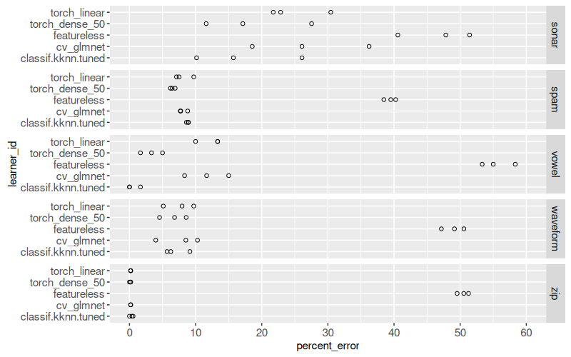
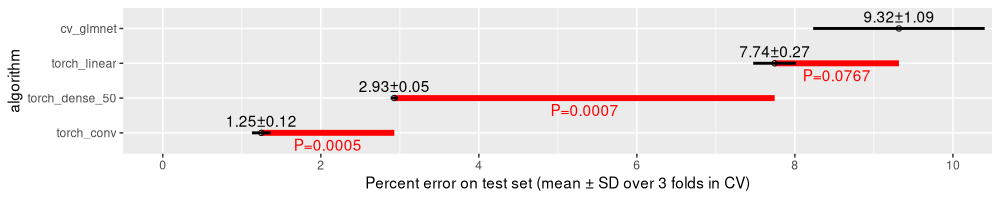

Le but de ce TP est de démontrer que différents algorithmes d’apprentissage sont préférables pour différents jeux de données.

Téléchargez [vowel](https://hastie.su.domains/ElemStatLearn/datasets/vowel.train) et [waveform](https://hastie.su.domains/ElemStatLearn/datasets/waveform.train) (pas besoin des données test).

Utilisez [`cross_validate`](https://scikit-learn.org/stable/modules/cross_validation.html#the-cross-validate-function-and-multiple-metric-evaluation) avec valdation croisée à 5 divisions, sur chaque jeu de données, avec chaque algorithme d’apprentissage.

* [LogisticRegressionCV](https://scikit-learn.org/stable/modules/generated/sklearn.linear_model.LogisticRegressionCV.html)
* [DummyClassifier](https://scikit-learn.org/stable/modules/generated/sklearn.dummy.DummyClassifier.html#sklearn.dummy.DummyClassifier)
* `GridSearchCV(cv=3)` avec `KNeighborsClassifier` pour coder les plus proches voisins, avec nombre de voisins entre 1 et 40. 

Il devrait avoir deux boucles, sur les algorithmes et les jeux de données.
Sauvegarder tous les résultats dans un DataFrame.
Utilisez plotnine pour dessiner les résultats.

* X = taux d’erreur
* Y = algorithme
* un point pour chaque division de validation croisée
* `facet_grid()` un panneau pour chaque jeu de données

Comme ça

Soumettez un fichier PDF avec vos codes et vos graphiques.

* mettez en gras une section « extra points » si vous tenter les exercises facultatives ci-dessous.
* suivez [les standards dans la rédaction de code python](https://docs.google.com/document/d/1Co1y6bvnNdadnzwAt575JFLkIvGZsQ35ED3QJgMfA3Y/edit?tab=t.0)

## extra points

* +10 si vous codez une classe `GlmnetCV` avec méthodes `fit` et `predict` basés sur [cvglmnet](https://glmnet-python.readthedocs.io/en/latest/glmnet_vignette.html#Logistic-Regression).
* After calling the fit method, the best_params_ attribute stores which hyper-parameter was selected as best, so print out that value. Is it always the same for each data set and split, or does it vary?
* +10 si vous rajoutez `geom_text` avec la moyenne ± écart type, trier Y par moyenne, et un autre `geom_text` avec P d’un T-test pour savoir s’il y a une différence significatif entre les algos, comme ça

